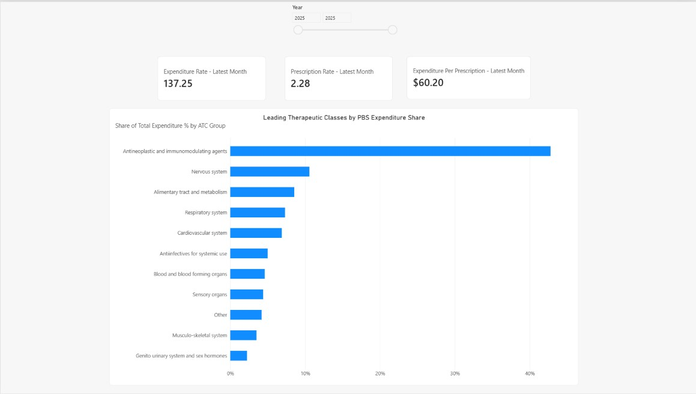
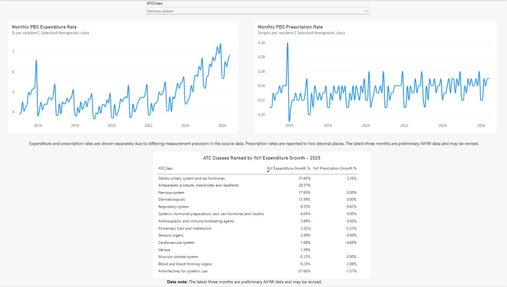

# Australian Pharmaceutical Market Intelligence — PBS Utilisation & Expenditure Analysis

## 1. Project Overview

This Power BI portfolio project analyses Australian Pharmaceutical Benefits Scheme (PBS) utilisation and government expenditure data from 2015–2026. The project transforms raw Australian Institute of Health and Welfare (AIHW) data into a validated star-schema model, applies DAX-based trend and growth analysis, and surfaces business-relevant patterns across therapeutic drug classes.

The dashboard is designed as a market-intelligence case study: which therapeutic classes account for the greatest PBS expenditure, how expenditure and utilisation are changing over time, and where expenditure growth is diverging from prescription-volume growth.

> **Scope note:** The source measures used here are per-resident rates (`Benefits per ERP` and `Scripts per ERP`), not raw national dollar totals or prescription counts.

---

## 2. Business Questions

This project answers four core questions:

1. Which ATC Level 1 therapeutic classes account for the greatest share of PBS expenditure?
2. How have expenditure and prescription rates changed from 2015 to 2026?
3. Which therapeutic classes are growing or declining most strongly year over year?
4. Where is expenditure growth materially different from prescription growth, indicating areas for deeper item-level investigation?

---

## 3. Data Source

**Primary source:** Australian Institute of Health and Welfare (AIHW), _Pharmaceutical Benefits Scheme prescriptions: monthly data_.

- AIHW dashboard: https://www.aihw.gov.au/reports/medicines/pbs-monthly-data/contents/dashboard
- AIHW data page: https://www.aihw.gov.au/reports/medicines/pbs-monthly-data/data
- AIHW technical notes: https://www.aihw.gov.au/reports/medicines/pbs-monthly-data/contents/technical-notes

The analysis uses:

- monthly observations from **January 2015 to June 2026**
- national and state/territory geography
- **Total** age group
- ATC Level 1 therapeutic classes
- `Benefits per ERP` as the expenditure-rate measure
- `Scripts per ERP` as the prescription-rate measure

The AIHW states that the latest three months of statistics are preliminary because late claims and claim adjustments may revise recent observations.

---

## 4. Data Preparation & Quality Controls

Raw AIHW tables were transformed in Power Query before modelling.

### Transformations

1. Filtered 'Age group' to **Total**.
2. Renamed:
   - `Type of script` → `ATCClass`
   - `Value` → `MeasureType`
3. Unpivoted monthly columns into:
   - `Month`
   - `MeasureValue`
4. Pivoted `MeasureType` so the final fact table contains:
   - `Benefits per ERP`
   - `Scripts per ERP`
5. Standardised geography:
   - national rows → `Geography = Australia`, `GeographyLevel = National`
   - state/territory rows → `GeographyLevel = State/Territory`
6. Standardised six truncated ATC labels found in the state/territory source so they matched the full national labels.
7. Appended the national and state/territory sources into `FactPBS`.
8. Built dedicated Date, Geography and ATC dimensions.
9. Added an `IsAggregate` flag to `DimATCClass` so the aggregate row `All PBS prescriptions` can be excluded consistently from therapeutic-class visuals and calculations.

### ATC label standardisation

The following truncated state/territory labels were mapped to their full equivalents:

| Truncated label                | Standardised label                                              |
| ------------------------------ | --------------------------------------------------------------- |
| Alimentary tract and metabolis | Alimentary tract and metabolism                                 |
| Genito urinary system and sex  | Genito urinary system and sex hormones                          |
| Systemic hormonal preparations | Systemic hormonal preparations, excl. sex hormones and insulins |
| Antiinfectives for systemic us | Antiinfectives for systemic use                                 |
| Antineoplastic and immunomodul | Antineoplastic and immunomodulating agents                      |
| Antiparasitic products, insect | Antiparasitic products, insecticides and repellents             |

After cleaning, the ATC dimension contains **14 genuine ATC Level 1 therapeutic classes plus one aggregate (`All PBS prescriptions`)**.

> **Final row-count check:** The model was previously validated at 18,630 fact rows before the label-standardisation cleanup. Because label replacement should not alter row count, the expected final count remains 18,630; re-check the final `FactPBS` row count before quoting the exact number publicly. Until then, use **18,000+ records** in portfolio/resume wording.

---

## 5. Data Model

The Power BI model uses a star schema.

### Fact table

`FactPBS`

- `ATCClass`
- `Month`
- `Geography`
- `Benefits per ERP`
- `Scripts per ERP`

### Dimension tables

`DimDate`

- `Date`
- `MonthStart`
- `Year`
- `Month Number`
- `Month Name`
- `Quarter`
- `Year-Month`

`DimGeography`

- `Geography`
- `GeographyLevel`

`DimATCClass`

- `ATCClass`
- `IsAggregate`
- `ATC Group` (Top 10 / Other grouping)

### Relationships

- `DimDate[Date]` 1 → \* `FactPBS[Month]`
- `DimGeography[Geography]` 1 → \* `FactPBS[Geography]`
- `DimATCClass[ATCClass]` 1 → \* `FactPBS[ATCClass]`

All relationships are active, one-to-many and single-direction.

---

## 6. Core DAX Measures

```DAX
Total Expenditure Rate =
SUM('FactPBS'[Benefits per ERP])
```

```DAX
Total Prescription Rate =
SUM('FactPBS'[Scripts per ERP])
```

```DAX
Expenditure per Prescription =
DIVIDE(
    [Total Expenditure Rate],
    [Total Prescription Rate]
)
```

```DAX
YoY Expenditure Growth % =
VAR Curr =
    [Total Expenditure Rate]
VAR Prior =
    CALCULATE(
        [Total Expenditure Rate],
        SAMEPERIODLASTYEAR('DimDate'[Date])
    )
RETURN
    DIVIDE(Curr - Prior, Prior)
```

```DAX
YoY Prescription Growth % =
VAR Curr =
    [Total Prescription Rate]
VAR Prior =
    CALCULATE(
        [Total Prescription Rate],
        SAMEPERIODLASTYEAR('DimDate'[Date])
    )
RETURN
    DIVIDE(Curr - Prior, Prior)
```

```DAX
Share of Total Expenditure % =
VAR TotalATCExpenditure =
    CALCULATE(
        [Total Expenditure Rate],
        REMOVEFILTERS('DimATCClass'),
        'DimATCClass'[IsAggregate] = FALSE()
    )
RETURN
    DIVIDE(
        [Total Expenditure Rate],
        TotalATCExpenditure
    )
```

Latest-month KPI measures are used on the Market Overview page so a selected year displays its latest available month rather than summing per-resident monthly rates into a misleading annual KPI.

---

## 7. Analytical Design Decisions

Several modelling and visualisation decisions were made specifically to protect analytical integrity:

- **National and state rows are not summed together.** Dashboard pages used for national analysis are explicitly filtered to `GeographyLevel = National`.
- **`All PBS prescriptions` is treated as an aggregate, not an ATC class.** It is excluded from therapeutic-class rankings, slicers, share denominators and movers tables using `DimATCClass[IsAggregate]`.
- **Expenditure and prescription trends are shown on separate line charts.** Prescription rates are reported at limited precision, and a dual-axis chart visually exaggerated small `0.01 ↔ 0.02` changes.
- **2025 is used for the ranked YoY movers table.** 2026 is only available through June and is therefore not a complete calendar year.
- **Causal claims are not inferred from ATC Level 1 movements alone.** External evidence is required before attributing a class-level spike to a specific event.

---

## 8. Dashboard Pages

### Page 1 — Market Overview



The first page provides a national market snapshot.

**Components**

- Expenditure Rate — latest month
- Prescription Rate — latest month
- Expenditure per Prescription — latest month
- Year slicer
- Top 10 + Other therapeutic-class expenditure-share chart

**Question answered:**  
_Which therapeutic classes account for the greatest share of PBS expenditure?_

The Top 10 grouping is based on an all-time national ranking, while the selected year controls the displayed expenditure shares.

---

### Page 2 — Trend Analysis



The second page supports therapeutic-class drill-down and cross-class comparison.

**Components**

- single-select ATC class slicer
- monthly expenditure-rate trend
- monthly prescription-rate trend
- 2025 YoY movers table across all 14 genuine ATC Level 1 classes

The ATC slicer filters the two trend charts but intentionally does **not** filter the movers table, allowing the selected class to be viewed in context against the full market.

**Question answered:**  
_What trends exist over time, which classes are growing or declining, and where is expenditure diverging from utilisation volume?_

**Data note:** Expenditure and prescription rates are shown separately due to differing measurement precision in the source data. The latest three months of AIHW statistics are preliminary and may be revised.

---

## 9. Key Insights

### Insight 1 — The 2016 antiinfectives expenditure spike is linked to hepatitis C DAA listings

**Observation**  
Expenditure for **Antiinfectives for systemic use** rose sharply around 2016 and then declined substantially over subsequent years.

**Interpretation**  
This movement coincides with the March 2016 PBS listing of new direct-acting antiviral medicines for hepatitis C. AIHW reports that these medicines contributed substantially to the rise in PBS expenditure from March 2016 onward. This provides an evidence-backed explanation for the class-level spike rather than relying on an unsupported causal inference.

**Recommendation**  
When a therapeutic class shows an abrupt expenditure discontinuity, investigate PBS listing and reimbursement events before treating the movement as a broad underlying market trend. For market-intelligence work, maintain an event layer containing major listings, policy changes and patent/biosimilar milestones.

**Supporting source:**  
AIHW, _Australia's health 2018 — Medicines in the health system_:  
https://www.aihw.gov.au/getmedia/0a72d3ba-8b33-4f03-9813-a626b27c96f0/aihw-aus-221-chapter-7-6.pdf.aspx

---

### Insight 2 — PBS expenditure is highly concentrated

**Observation**  
In the analysed view, the Top 10 therapeutic classes account for approximately **95.81%** of total expenditure across genuine ATC Level 1 classes. **Antineoplastic and immunomodulating agents** alone represents roughly **43%** in the selected 2025 view and shows sustained expenditure-rate growth over the period rather than a single isolated spike.

**Interpretation**  
PBS expenditure is structurally concentrated in a relatively small number of broad therapeutic areas. Persistent growth in a large class has greater long-term budget significance than volatility in a small class.

**Recommendation**  
Prioritise deeper item-level market intelligence within the highest-spend therapeutic classes. For a generics/biosimilars-oriented follow-on project, investigate medicine-level and brand-level data within these classes to identify where competition could materially affect government expenditure.

> The generic/biosimilar implication is a **future-work hypothesis**, not something proven by this ATC Level 1 dataset.

---

### Insight 3 — Expenditure growth can materially outpace utilisation growth

**Observation**  
For **Genito urinary system and sex hormones**, 2025 expenditure-rate growth was approximately **+31.84%**, while prescription-rate growth was approximately **+5.56%**.

**Interpretation**  
The divergence indicates that volume growth alone does not explain the expenditure movement. Possible drivers include treatment mix, cost per prescription, new PBS listings or other reimbursement effects; the ATC Level 1 dataset cannot distinguish among them.

**Recommendation**  
Flag large expenditure-versus-utilisation divergences for item-level investigation. Joining PBS item, medicine and listing information would allow analysts to identify which products are responsible and whether the effect is driven by price, mix or utilisation.

---

## 10. Technologies Used

- **Power BI Desktop** — data modelling, DAX and dashboard design
- **Power Query** — data cleaning and transformation
- **DAX** — measures, calculated columns and time intelligence
- **Microsoft Excel** — raw AIHW source format
- **Git / GitHub** — version control and portfolio publishing
- **Data source:** Australian Institute of Health and Welfare (AIHW)

---

## 11. Limitations & Future Work

### Data quality and limitations

1. **Per-resident measures, not raw totals**  
   `Benefits per ERP` and `Scripts per ERP` are population-adjusted rates. They cannot directly answer questions requiring absolute national expenditure or prescription counts.

2. **Recent observations are preliminary**  
   AIHW states that the latest three months are incomplete and subject to revision as claims continue to be processed.

3. **ATC labels required standardisation**  
   Six truncated labels in the state/territory source initially produced false duplicate categories. These were mapped to their full equivalents. Temporal ATC reclassification across 2015–2026 has **not** been separately established.

4. **Prescription-rate precision is limited**  
   `Scripts per ERP` is supplied at low decimal precision. For small rates, one rounding step can look disproportionately large on a chart. Expenditure and prescription trends are therefore shown separately.

5. **National and state observations coexist**  
   Australia is an aggregate alongside eight states/territories. Summing them would be analytically invalid. National dashboard pages explicitly filter `GeographyLevel = National`.

6. **No generic, biosimilar or brand-level data**  
   ATC Level 1 cannot measure generic or biosimilar penetration. This requires item/brand-level PBS data and is intentionally out of scope.

7. **`All PBS prescriptions` is an aggregate**  
   It is not a therapeutic class and is excluded consistently using the `IsAggregate` dimension flag.

8. **ATC Level 1 is highly aggregated**  
   Class-level movements identify areas for investigation but cannot independently establish whether a change is caused by price, product mix, new listings or utilisation.

9. **2026 is a partial year**  
   The dataset ends in June 2026, so 2026 annual totals/rates should not be directly compared with complete calendar years. The YoY movers table uses 2025 as the latest complete year.

### Future work

- ingest PBS item-level data for medicine/product-level analysis
- add generic/biosimilar and brand/originator segmentation where source data permits
- create an event table for PBS listings and major policy/reimbursement changes
- add state/territory benchmarking without aggregating per-resident rates across states
- evaluate forecasting only after building a sufficiently controlled and validated item-level time series

---

## Reproduction Notes

To reproduce the project:

1. Download the relevant AIHW PBS monthly source data.
2. Download the source workbook(s) from AIHW.
3. Open pbix/PBS_Market_Intelligence.pbix.
4. Update the Power Query source path to the downloaded workbook if required.
5. Refresh the model.
6. Open `pbix/PBS_Market_Intelligence.pbix`.
7. If necessary, update Power Query source paths to the local raw-data files.
8. Refresh the model.
9. Confirm:
   - 15 `DimATCClass` rows
   - 14 rows where `IsAggregate = FALSE()`
   - 1 row where `IsAggregate = TRUE()`
   - `GeographyLevel = National` on national dashboard pages
   - Page 2 movers table contains 14 therapeutic-class rows
   - 2025 is used for the complete-year YoY ranking
10. Re-check the final `FactPBS` row count before replacing **18,000+** with an exact count in public-facing text.

---

## License / Attribution

This repository contains analysis built from publicly available Australian Government / AIHW data. Source data remains subject to the terms and attribution requirements of the original publisher.

This project is an independent portfolio analysis and is not affiliated with or endorsed by AIHW, Services Australia or the Australian Government.
